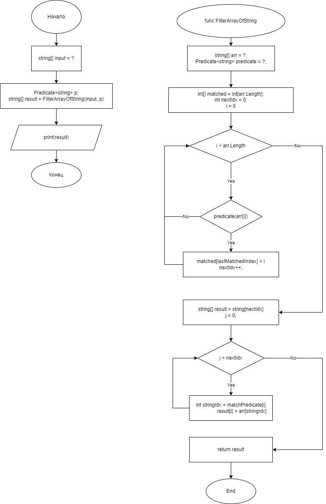

# Итоговая проверочная работа.
**Задача:**

Написать программу, которая из имеющегося массива строк формирует массив из строк, длина которых меньше либо равна 3 символам. Первоначальный массив можно ввести с клавиатуры, либо задать на страте выполнения алгоритма. При решении не рекомендуется пользоваться коллекциями, лучше обойтись исключительно массивами.

**Примеры**

```
["Russia", "Kazan", "Denmark"] -> []
["1234", "1567", "-2", "computer science"] -> ["-2"]
["hello", "2", "word", ":-)"] -> ["2", ":-)"]
```

**Блок схема:**
